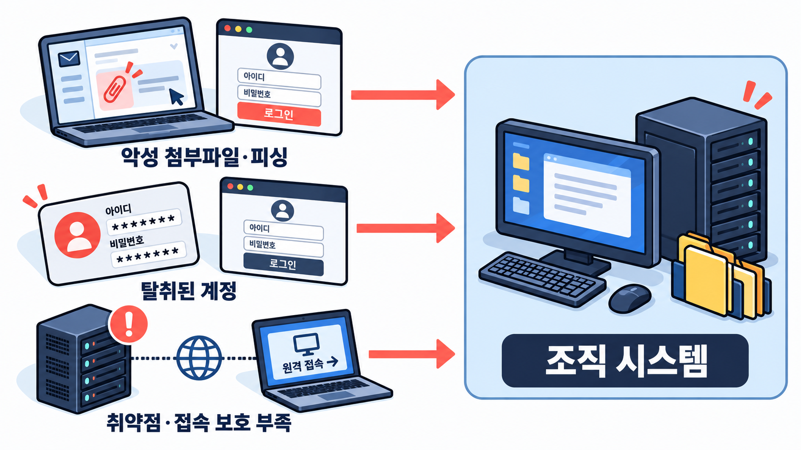
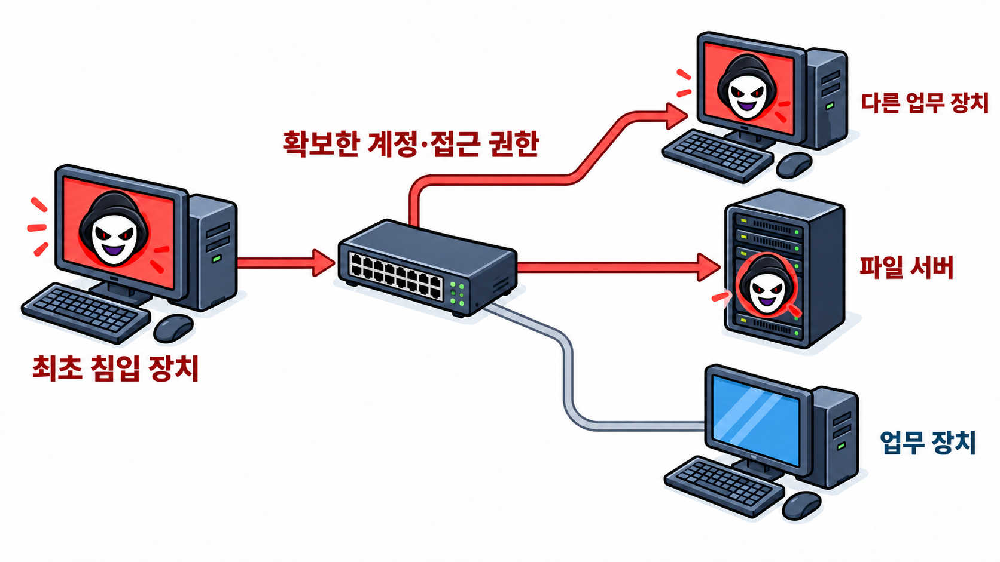

## 1. 데이터를 사용할 수 없게 만들고 복구 대가를 요구한다

랜섬웨어는 데이터를 암호화하거나 시스템 사용을 차단한 뒤, 접근을 되돌려 주겠다는 대가로 금전을 요구하는 악성 소프트웨어의 일종이다. 대표적인 방식은 파일을 암호화해 소유자가 내용을 읽지 못하게 만드는 것이다. 파일이 저장 장치에 남아 있어도 사용할 수 없다면, 해당 데이터에 의존하는 업무와 서비스도 중단될 수 있다.

암호화 자체는 정보를 보호하는 기술이다. 데이터를 암호 알고리즘과 키로 변환하고, 키를 이용해 복호화하면 원래 내용을 되찾을 수 있다. 랜섬웨어는 이 기술을 악용해 피해자의 데이터 사용을 막는다. 여기서 악성코드를 제거하는 것과 암호화된 파일을 복원하는 것은 별개의 작업이다. 악성코드를 지웠다고 파일이 자동으로 복호화되지는 않는다.

## 2. 업무 중단과 정보 공개 위협으로 금전을 갈취한다

랜섬웨어 공격의 주된 목적은 피해자를 압박해 금전을 갈취하는 것이다. 공격자는 시스템과 데이터의 ‘가용성’을 침해한다. 가용성이란 권한이 있는 사용자가 필요한 때에 시스템과 데이터를 이용할 수 있는 상태를 뜻한다. 업무에 필요한 파일이나 서버를 사용할 수 없게 만들고, 복구를 조건으로 돈을 요구하는 방식이다.

데이터 탈취가 함께 이뤄지는 경우에는 민감정보의 공개도 협박 수단이 된다. 공격자는 개인정보나 기업 내부 자료를 외부로 빼낸 뒤 공개하지 않는 대가로 금전을 요구할 수 있다. 피해 조직이 백업으로 업무를 재개하더라도, 탈취된 정보에 대한 압박은 남을 수 있다.

2017년 국내 웹호스팅 업체 인터넷나야나는 Erebus 랜섬웨어 공격으로 서버 153대가 감염되고, 약 3,400개 고객 웹사이트에 장애가 발생했다. 회사는 암호화된 데이터를 복구하기 위해 공격자와 협상했고, 약 13억 원을 지급하는 조건으로 복호화 키를 받기로 했다. 이 사건은 랜섬웨어가 데이터 사용을 막아 서비스를 중단시키고, 복구가 시급한 피해자에게 금전 지급을 압박하는 방식을 보여준다.

## 3. 이메일부터 계정과 원격 접속 서비스까지

피싱과 악성 이메일은 랜섬웨어 공격의 침입 경로 중 하나다. 공격자는 정상적인 업무 연락으로 위장해 악성 첨부파일을 실행하게 하거나, 가짜 로그인 페이지로 유도해 계정 정보를 탈취한다. 훔친 계정으로 조직의 시스템에 접근한 뒤 랜섬웨어를 배포할 수도 있다.

소프트웨어 취약점과 원격 접속 서비스도 악용된다. 외부에 노출된 서버나 장비에 보안 패치가 적용되지 않았거나, 원격 접속 계정이 충분히 보호되지 않았다면 공격자의 진입점이 될 수 있다. 이메일을 조심하는 것과 함께 계정 보호, 보안 업데이트, 외부 접속 경로 관리가 필요한 이유다.

원격 접속 서비스 자체가 악성인 것은 아니다. 조직이 업무에 사용하는 정상적인 기능도 공격자가 계정이나 접근 권한을 확보하면 침입과 확산에 이용할 수 있다.

## 4. 침입 이후 권한을 넓히고 다른 시스템으로 이동한다

랜섬웨어 공격은 초기 침입, 권한 확보·확대, 내부 이동, 데이터 탈취와 백업 방해, 암호화와 협박으로 이어질 수 있다. 처음 접근한 장치에서 더 높은 권한을 확보하거나, 다른 서버와 계정에 접근하며 공격 범위를 넓히는 흐름이다.

공격자가 내부 시스템에 접근하면 중요 데이터를 찾거나 백업을 삭제·암호화해 복구를 방해할 수 있다. 데이터를 탈취한 뒤 랜섬웨어를 실행하는 경우도 있다. 피해자가 파일 암호화를 발견한 시점에는 이미 다른 침해 행위가 진행됐을 가능성이 있다는 뜻이다. NIST는 공격자가 일정 기간 탐지되지 않은 채 머물며 데이터를 훔친 뒤 랜섬웨어를 실행하는 상황도 있다고 설명한다.

랜섬웨어 공격은 최초로 침입한 컴퓨터에서 끝나지 않을 수 있다. 안랩이 분석한 실제 침해 사례에서는 공격자가 원격 데스크톱(RDP)의 관리자 계정에 로그인한 뒤 네트워크 스캔과 계정정보 탈취 도구를 사용했다. 이후 내부 네트워크의 다른 시스템으로 이동해 랜섬웨어를 배포했다. 이 사례는 공격자가 확보한 접근권한과 내부 시스템 간 연결 관계에 따라 감염 범위가 확대될 수 있음을 보여준다.

다만 이 과정은 모든 공격에 적용되는 고정된 순서가 아니다. 일부 단계가 생략되거나 동시에 진행될 수 있고, 데이터 탈취 없이 암호화만 이뤄질 수도 있다. 특정 사건의 침입 경로나 공격 순서는 조사 결과를 통해 확인해야 한다.

## 5. 암호화 피해와 정보 유출은 다르다

랜섬웨어로 파일과 시스템을 사용할 수 없게 되면 업무 중단과 서비스 장애가 발생할 수 있다. 사용할 수 있는 백업이나 복호화 수단이 없다면 데이터 복구가 어려워지거나 불가능해질 수도 있다. 몸값을 지급해도 복구가 보장되지는 않는다. FBI 역시 금전 지급이 데이터 반환을 보장하지 않는다고 경고한다.

협박 방식은 암호화 중심 갈취, 이중 갈취로 나눠 살펴볼 수 있다. 암호화 중심 갈취는 데이터를 사용할 수 없게 만든 뒤 복호화 대가를 요구하는 방식이다. 이중 갈취는 암호화와 함께 탈취한 정보의 공개를 협박하는 방식이다.

암호화는 데이터 사용을 막고, 정보 탈취는 데이터가 허가받지 않은 사람에게 넘어가게 한다. 백업에서 파일을 복원해도 공격자가 확보한 복사본이 사라지는 것은 아니다. 사고 대응에서는 업무 복구와 함께 정보 유출 여부와 범위도 확인해야 한다.

## 6. 계정 보호, 탐지, 복구 준비를 함께 갖춘다

예방의 출발점은 계정과 시스템을 보호하는 것이다. 다중 요소 인증(MFA)은 서로 다른 유형의 인증 요소를 둘 이상 요구하는 방식으로 비밀번호 외에 추가 인증 요소를 요구해 탈취된 비밀번호만으로 계정에 접근하기 어렵게 한다. 운영체제와 소프트웨어에는 보안 패치를 적용하고, 사용자가 업무에 필요한 권한만 갖도록 관리해야 한다. 불필요한 원격 접속 서비스를 줄이고 내부 시스템 간 접근을 제한하는 조치도 피해 확산을 줄이는 데 도움이 된다.

침입을 조기에 발견할 수 있는 탐지 수단도 필요하다. 엔드포인트 탐지 및 대응(EDR)은 PC와 서버 등 단말의 활동을 살펴 의심스러운 행위를 탐지하고 조사·대응을 지원하는 기술이다. 예를 들어 어떤 프로세스가 실행됐는지, 단말이 어떤 주소로 네트워크 연결을 시도했는지 등을 살펴 이상 징후를 찾는다. 보안 도구를 설치하는 데서 그치지 않고, 경고와 로그를 확인해 실제 대응으로 연결해야 한다.

백업은 운영 시스템이 침해돼도 함께 훼손되지 않도록 보호해야 한다. 같은 장치의 다른 폴더에 복사하는 것만으로는 충분하지 않다. 운영 시스템의 계정이 탈취돼도 백업을 쉽게 삭제하거나 변경하지 못하도록 접근 권한을 별도로 관리하고, 오프라인 백업 등으로 네트워크를 통한 접근도 제한해야 한다. 필요한 데이터를 실제로 복원할 수 있는지 정기적으로 시험하는 과정도 필요하다. 백업이 만들어졌다는 기록만으로 복구 가능성을 보장할 수는 없다.

감염이나 침해가 의심되면 영향을 받은 시스템을 네트워크에서 격리하고 사고 대응 절차를 가동해야 한다. 이후 로그 등 조사에 필요한 증거를 보존하면서 침입 경로, 피해 범위, 데이터 탈취 여부를 확인하고 복구를 진행할 수 있도록 한다. 재가동 전에는 공격자의 접근 수단과 남아 있는 악성코드를 점검해야 한다. 시스템이 다시 작동하는지뿐 아니라 같은 경로로 재침입할 수 있는지도 확인하는 과정이다.

---

## 참고자료 및 출처

1. [FBI — Ransomware](https://www.fbi.gov/how-we-can-help-you/common-frauds-and-scams/ransomware)
   랜섬웨어 정의, 피해, 몸값 지급의 한계와 예방 조치.

2. [NIST — Encryption](https://csrc.nist.gov/glossary/term/encryption)
   암호화와 복호화의 기술적 개념.

3. [NIST — Ransomware Risk Management: A Cybersecurity Framework 2.0 Community Profile](https://csrc.nist.gov/pubs/ir/8374/r1/final)
   랜섬웨어와 정보 탈취를 이용한 금전 요구, 위험 관리 체계.

4. [NCSC — Mitigating Malware and Ransomware Attacks](https://www.ncsc.gov.uk/guidance/mitigating-malware-and-ransomware-attacks)
   원격 접속 경로 보호, 다중 요소 인증, 권한 관리와 내부 확산 제한.

5. [NIST — Ransomware](https://www.nist.gov/itl/smallbusinesscyber/guidance-topic/ransomware)
   침입·데이터 탈취·랜섬웨어 실행의 관계와 공격 사례 설명.

6. [CISA — #StopRansomware Guide](https://www.cisa.gov/stopransomware/ransomware-guide)
   이중 갈취와 데이터 갈취의 구분, 백업 보호, 시스템 격리와 사고 대응.

7. [CISA — #StopRansomware: Play Ransomware](https://www.cisa.gov/news-events/cybersecurity-advisories/aa23-352a)
   EDR을 활용한 내부 이동 탐지 등 방어 조치.

8. [연합뉴스 — 인터넷나야나 "랜섬웨어 피해 복구중"…'해커와 13억 협상' 논란(종합)](https://www.yna.co.kr/view/AKR20170615125151017)
   2017년 6월 15일 보도. Erebus 랜섬웨어로 서버 153대가 감염되고 약 3,400개 웹사이트가 영향을 받은 사건. 피해 복구를 위해 약 13억 원을 지급하기로 합의한 경위.

9. [안랩 ASEC — 공격자의 시스템도 다른 공격자에 노출되고 악용될 수 있다](https://asec.ahnlab.com/ko/73884/)
   RDP 관리자 계정 접근, 네트워크 스캔, 계정정보 탈취와 내부 이동, 랜섬웨어 배포 과정을 설명하는 기술 분석.
