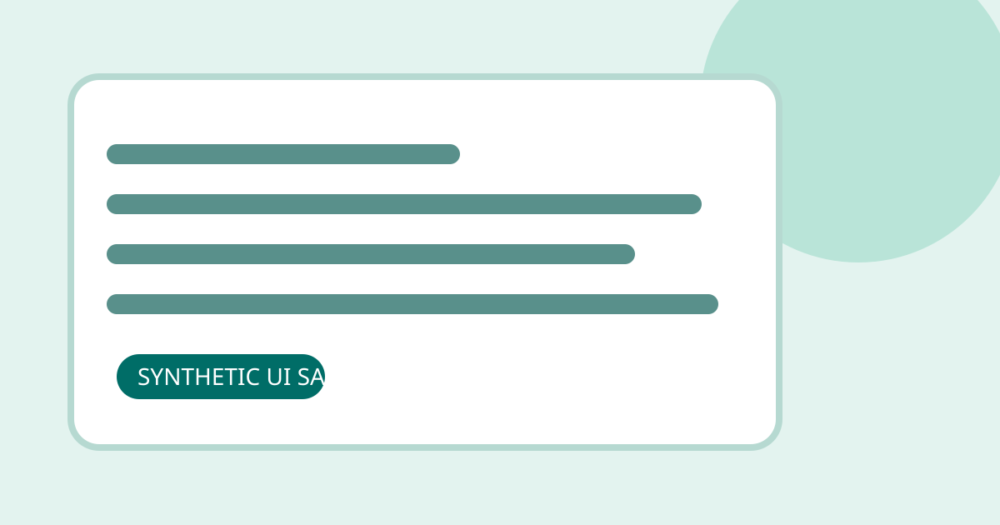

> **가상 UI 테스트 기사입니다.** 실제 보안 사건, 취약점, 권고를 설명하지 않습니다. 공개 전 이 샘플 폴더를 삭제하거나 `draft: true`로 바꾸세요.

## 왜 이 샘플이 있나요?

실제 기사를 게시하기 전에 긴 제목이 목록과 상세 화면에서 어떻게 줄바꿈되는지, 독자가 핵심 내용을 빠르게 찾을 수 있는지 확인하는 가상 원고입니다. 아래 수치와 이름은 모두 화면 테스트용이며 실제 측정 자료가 아닙니다.



### 확인할 요소

- 모바일 폭에서도 제목과 문단이 화면 안에서 줄바꿈됩니다.
- 핵심 요점 상자는 긴 본문보다 먼저 보입니다.
- 표는 필요한 경우 표 내부에서 가로로 스크롤됩니다.
- 코드 블록도 페이지 너비를 늘리지 않고 자체 스크롤됩니다.
- 샘플 태그와 별칭은 홈의 통합 검색에서 찾을 수 있습니다.

## 가상 화면 점검 표

| UI 항목 | 샘플 값 | 확인 목적 | 비고 |
| --- | --- | --- | --- |
| 목록 제목 | 긴 가상 보안 이슈 제목 | 말줄임과 줄바꿈 | 실제 사건 아님 |
| 본문 이미지 | 로컬 SVG 파일 | 상대 경로와 대체 텍스트 | 직접 만든 샘플 |
| 표 | 이 화면만을 위한 가상 행 | 좁은 화면 overflow | 실제 자료 아님 |
| 코드 | 테스트용 문자열 | 코드 영역 스크롤 | 실행하지 않음 |

## 코드 블록 샘플

```ts
type UiFixture = {
  title: string;
  isSynthetic: true;
};

const fixture: UiFixture = {
  title: "화면 검증 전용 샘플",
  isSynthetic: true,
};

console.log(fixture.title);
```

아래의 긴 링크 형태도 본문 너비 밖으로 밀려나지 않는지 확인합니다: https://example.invalid/ui-fixture/a-very-long-path/used-only-to-test-wrapping-and-never-as-a-real-reference

## 정리

실제 보안 정보가 아니라 시각 회귀와 원고 작성 흐름을 살펴보기 위한 예제입니다. 이 폴더를 복사해 새 기사를 만들 수 있지만, 게시 전에는 샘플 문구·별칭·이미지를 모두 실제 원고에 맞게 교체해야 합니다.
