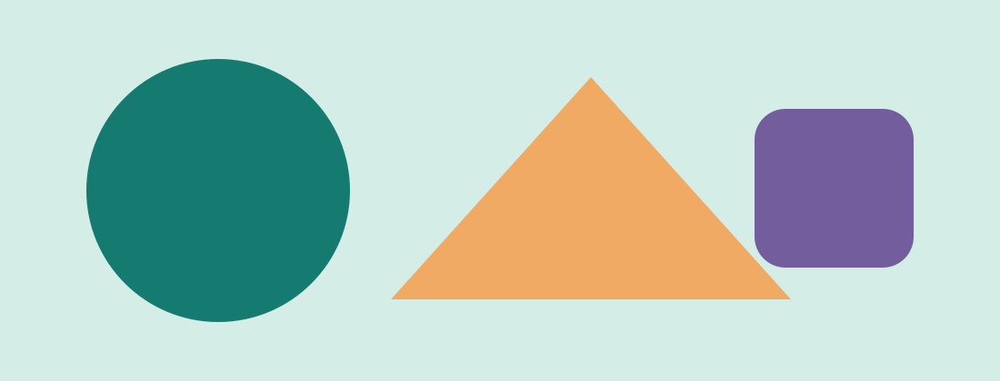
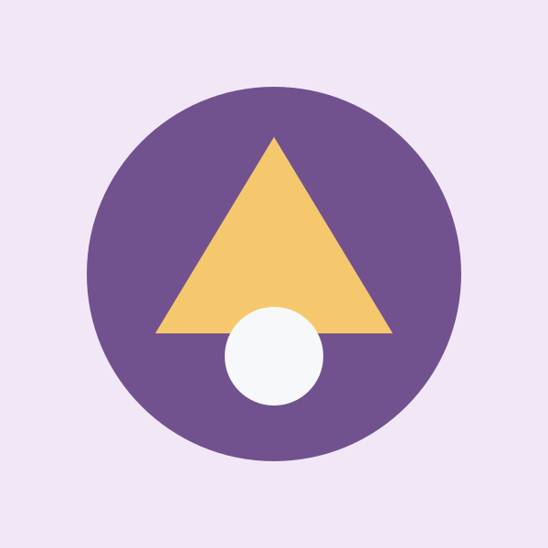
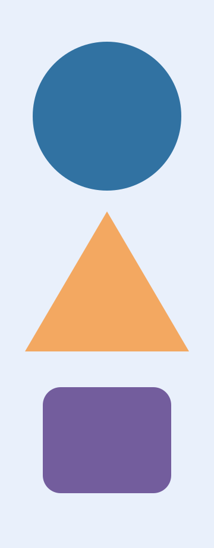

> **가상 UI 테스트 기사입니다.** 아래 도형은 실제 제품이나 보안 사건을 나타내지 않습니다.

## 이미지 비율 샘플

각 그림은 이 기사 폴더의 `images/` 안에 있는 SVG입니다. 화면 폭보다 큰 원본도 레이아웃 바깥으로 넘치지 않고 읽을 수 있는 너비로 줄어드는지 확인합니다.

### 가로 이미지

### 정사각 이미지

### 세로 이미지

## 표시 형태 메모

| 비율 종류 | 파일 | UI에서 확인할 점 |
| --- | --- | --- |
| 가로 | shape-landscape.svg | 표지와 본문 너비 |
| 정사각형 | shape-square.svg | 본문 여백 |
| 세로 | shape-portrait.svg | 긴 이미지 높이와 페이지 overflow |

이 예시는 직접 만든 단순 도형이며 외부 이미지, 상표, 사진을 포함하지 않습니다. 실제 기사를 작성할 때는 이미지 설명과 사용 권리, 출처 표기를 별도로 확인하세요.
