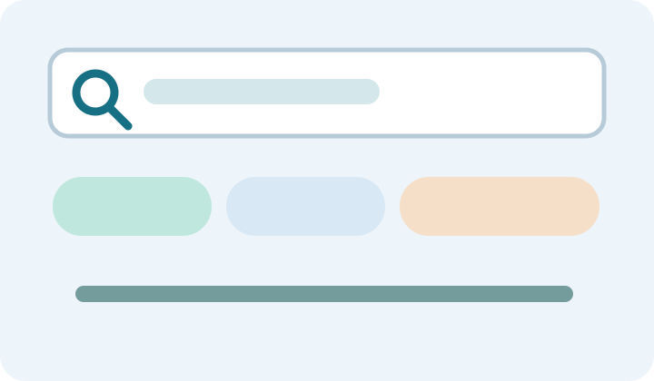

> **가상 UI 테스트 기사입니다.** 이 문서의 모든 설명은 검색 UI 확인을 위해 지어낸 예시이며 실제 보안 사건이나 제품을 가리키지 않습니다.

## 검색 동작을 위한 가상 원고

이 문단에는 **본문 전용 검색어**가 들어 있습니다. 화면에서 `본문 전용 검색어`를 입력하면 이 기사를 찾을 수 있는지 확인하세요. 태그에는 “검색 테스트”와 “태그 검색”을 넣어 검색이 제목만 보는지, 기사 메타데이터도 포함하는지 검증합니다.

### 정렬 시나리오

게시 날짜는 서로 다른 샘플 기사 사이에서 최신순과 오래된순 결과를 확인하기 위한 값입니다. 제목 가나다순에서는 다른 샘플 제목과 함께 순서가 자연스럽게 바뀌는지 확인하세요. 이 원고에는 실제 위협 정보가 없습니다.

- 최신순: 게시 날짜가 더 최근인 샘플 우선
- 오래된순: 게시 날짜가 더 오래된 샘플 우선
- 가나다순: 한국어 제목을 한국어 숫자 정렬 규칙으로 비교
- 같은 검색어에 페이지가 여러 개일 때 URL과 뒤로가기로 이동 상태 복원

### 가상 분류 표

| 검색 대상 | 샘플 문구 | 내용 출처 |
| --- | --- | --- |
| 본문 | 본문 전용 검색어 | 본문 문장 |
| 태그 | 검색 테스트 | frontmatter |
| 별칭 | 분류 검색 샘플 | frontmatter |
| 이미지 | search-map.svg | 이 폴더의 로컬 파일 |

## 샘플 원고 정리

실제 뉴스로 오해되지 않도록 이 파일을 게시 전 삭제하거나 `draft: true`로 바꾸세요. 이미지를 유지할 필요가 없다면 같은 폴더의 `images/search-map.svg`도 함께 삭제합니다.
